# App_DataModel.md
# MVP Appointment Booking Application — Data Model

## Document Control

| **Version** | **Date**   | **Author**            | **Changes**          |
|-------------|------------|-----------------------|----------------------|
| 1.0         | 2026-03-24 | AI Architecture Agent | Initial Draft        |

**Related Documents:**

| **Document** | **Location**         | **Description**                        |
|--------------|----------------------|----------------------------------------|
| BRD          | `docs/BRD.md`        | Business Requirements Document         |
| Epics        | `docs/Epics.md`      | Product Epics (EP-001 to EP-005)       |
| Features     | `docs/Features.md`   | 25 MVP Features (F-001 to F-025)       |
| HLD          | `docs/App_HLD.md`    | High-Level Design Document             |

---

## Table of Contents

1. [Overview](#1-overview)
2. [Entity-Relationship Overview](#2-entity-relationship-overview)
3. [Entities & Table Definitions](#3-entities--table-definitions)
   - 3.1 [users](#31-table-users)
   - 3.2 [doctors](#32-table-doctors)
   - 3.3 [specialties](#33-table-specialties)
   - 3.4 [doctor_working_hours](#34-table-doctor_working_hours)
   - 3.5 [blocked_slots](#35-table-blocked_slots)
   - 3.6 [appointments](#36-table-appointments)
   - 3.7 [audit_log](#37-table-audit_log)
4. [Relationships](#4-relationships)
5. [Indexes](#5-indexes)
6. [Constraints & Business Rules](#6-constraints--business-rules)
7. [Slot Generation Logic](#7-slot-generation-logic)
8. [Data Integrity](#8-data-integrity)
9. [Sample Data](#9-sample-data)
10. [Migration Notes](#10-migration-notes)

---

## 1. Overview

### 1.1 Database Technology

| **Attribute**       | **Value**                                        |
|---------------------|--------------------------------------------------|
| Database Engine     | SQLite 3.40+                                     |
| Mode                | WAL (Write-Ahead Logging) — enabled via PRAGMA   |
| File Location       | `/var/app/data/appointments.db` (production)     |
| ORM / Access Layer  | SQLAlchemy Core 2.x or raw parameterized SQL     |
| Character Encoding  | UTF-8                                            |
| Timezone            | All timestamps in UTC; display converted to local |
| Foreign Keys        | Enforced via `PRAGMA foreign_keys = ON`           |

### 1.2 Design Approach

The data model follows **Third Normal Form (3NF)** for all transactional data, with the following principles:

- **Referential integrity** enforced at the database level via foreign keys
- **Soft deletes** for appointments (status-based) and doctors (`status = 'inactive'`) — no hard deletes on business entities
- **Audit trail** via a dedicated `audit_log` table for all CREATE, CANCEL, and UPDATE operations
- **No PHI** (Protected Health Information) collected; only basic contact details (per BRD §4.2)
- **Timestamps** (`created_at`, `updated_at`) on all mutable tables for operational visibility
- **Slot-on-demand**: Available slots are computed dynamically at query time from `doctor_working_hours`, `blocked_slots`, and `appointments` — no pre-materialization of slot records

### 1.3 Entity Summary

| **Table**               | **Epic**       | **Description**                                    | **Est. Rows / Month** |
|-------------------------|----------------|----------------------------------------------------|-----------------------|
| `users`                 | EP-001         | Patient accounts and admin users                   | ~500 (initial)        |
| `doctors`               | EP-002, EP-005 | Doctor profiles managed by admin                   | ~10–50                |
| `specialties`           | EP-002         | Reference/lookup list of medical specialties       | ~20–30 (static)       |
| `doctor_working_hours`  | EP-005         | Weekly schedule per doctor per day                 | ~70 (7/doctor)        |
| `blocked_slots`         | EP-005         | Admin-blocked time periods for a doctor            | ~50–100               |
| `appointments`          | EP-003, EP-004 | Patient appointment bookings (core transact. table) | ~10,000               |
| `audit_log`             | All            | Immutable audit trail for all state changes        | ~15,000               |

---

## 2. Entity-Relationship Overview

### 2.1 Conceptual ERD

```
  ┌──────────────┐         ┌──────────────────────┐
  │    users     │         │       doctors         │
  │  (patients   │         │  (managed by admin)   │
  │  & admins)   │         └──────────┬───────────┘
  └──────┬───────┘                   │
         │                           │ 1
         │ books                     ├──────────────────────┐
         │ 1..*                      │                      │
  ┌──────▼────────────┐    ┌─────────▼────────┐   ┌────────▼──────────┐
  │   appointments    │    │doctor_working_    │   │  blocked_slots    │
  │  (core booking    │    │hours             │   │ (admin-managed    │
  │   transaction)    │    │(weekly schedule) │   │  exceptions)      │
  └───────────────────┘    └──────────────────┘   └───────────────────┘
         │
         │ logged in
         ▼
  ┌──────────────┐         ┌──────────────┐
  │  audit_log   │         │  specialties │
  │ (immutable   │         │  (reference  │
  │  trail)      │         │   lookup)    │
  └──────────────┘         └──────────────┘
```

### 2.2 Mermaid ERD (Logical)

```mermaid
erDiagram
    users {
        INTEGER id PK
        TEXT full_name
        TEXT email
        TEXT phone
        TEXT password_hash
        BOOLEAN is_admin
        BOOLEAN is_active
        DATETIME created_at
        DATETIME updated_at
    }

    doctors {
        INTEGER id PK
        TEXT full_name
        TEXT specialty
        TEXT bio
        TEXT photo_url
        TEXT email
        TEXT phone
        TEXT status
        DATETIME created_at
        DATETIME updated_at
    }

    specialties {
        INTEGER id PK
        TEXT name
        TEXT description
    }

    doctor_working_hours {
        INTEGER id PK
        INTEGER doctor_id FK
        INTEGER day_of_week
        TEXT start_time
        TEXT end_time
        BOOLEAN is_active
    }

    blocked_slots {
        INTEGER id PK
        INTEGER doctor_id FK
        DATE blocked_date
        TEXT start_time
        TEXT end_time
        TEXT reason
        INTEGER created_by FK
        DATETIME created_at
    }

    appointments {
        INTEGER id PK
        TEXT booking_id
        INTEGER patient_id FK
        INTEGER doctor_id FK
        DATE appointment_date
        TEXT start_time
        TEXT end_time
        TEXT status
        INTEGER cancelled_by FK
        TEXT cancellation_reason
        DATETIME created_at
        DATETIME updated_at
    }

    audit_log {
        INTEGER id PK
        TEXT entity_type
        INTEGER entity_id
        TEXT action
        INTEGER performed_by FK
        TEXT details
        DATETIME created_at
    }

    users ||--o{ appointments : "books (patient_id)"
    users ||--o{ appointments : "cancels (cancelled_by)"
    users ||--o{ blocked_slots : "creates (created_by)"
    users ||--o{ audit_log : "performs (performed_by)"
    doctors ||--o{ appointments : "has"
    doctors ||--o{ doctor_working_hours : "has"
    doctors ||--o{ blocked_slots : "has"
```



---

## 3. Entities & Table Definitions

---

### 3.1 Table: `users`

**Epic:** EP-001 (F-001, F-002, F-003, F-004, F-005)  
**Description:** Stores all application users including patients and admin accounts. A user with `is_admin = 1` has access to the Provider Administration module (EP-005). No separate admin table is used for MVP simplicity.

#### Column Definitions

| **Column**      | **Data Type**         | **Constraints**                       | **Description**                                                     |
|-----------------|-----------------------|---------------------------------------|---------------------------------------------------------------------|
| `id`            | `INTEGER`             | `PRIMARY KEY AUTOINCREMENT`           | Surrogate primary key; auto-incremented                             |
| `full_name`     | `TEXT`                | `NOT NULL`                            | Patient's full display name (first + last); max 200 chars           |
| `email`         | `TEXT`                | `UNIQUE NOT NULL`                     | Login identifier; RFC 5322 validated at app layer; lowercase stored |
| `phone`         | `TEXT`                | Nullable                              | 10-digit US phone; format validated at app layer (e.g. `5551234567`)|
| `password_hash` | `TEXT`                | `NOT NULL`                            | bcrypt hash (cost factor 12); never stores plain text               |
| `is_admin`      | `INTEGER` (BOOLEAN)   | `NOT NULL DEFAULT 0`                  | `0` = patient, `1` = admin; SQLite uses INTEGER for booleans        |
| `is_active`     | `INTEGER` (BOOLEAN)   | `NOT NULL DEFAULT 1`                  | `0` = deactivated account (soft delete for accounts)                |
| `created_at`    | `DATETIME`            | `NOT NULL DEFAULT (datetime('now'))` | UTC timestamp of account creation                                    |
| `updated_at`    | `DATETIME`            | `NOT NULL DEFAULT (datetime('now'))` | UTC timestamp of last profile update; updated via trigger or app    |

#### DDL

```sql
CREATE TABLE IF NOT EXISTS users (
    id           INTEGER  PRIMARY KEY AUTOINCREMENT,
    full_name    TEXT     NOT NULL,
    email        TEXT     NOT NULL,
    phone        TEXT,
    password_hash TEXT    NOT NULL,
    is_admin     INTEGER  NOT NULL DEFAULT 0 CHECK (is_admin IN (0, 1)),
    is_active    INTEGER  NOT NULL DEFAULT 1 CHECK (is_active IN (0, 1)),
    created_at   DATETIME NOT NULL DEFAULT (datetime('now')),
    updated_at   DATETIME NOT NULL DEFAULT (datetime('now')),
    CONSTRAINT uq_users_email UNIQUE (email)
);
```

#### Indexes

| **Index Name**       | **Columns** | **Type** | **Purpose**                                   |
|----------------------|-------------|----------|-----------------------------------------------|
| `pk_users`           | `id`        | PRIMARY  | Primary key lookup                            |
| `uq_users_email`     | `email`     | UNIQUE   | Login lookup; uniqueness enforcement          |
| `idx_users_is_admin` | `is_admin`  | STANDARD | Filter admin users in admin module            |

#### Business Rules

- Email is stored in lowercase; enforced at application layer before INSERT
- `is_admin = 1` grants access to all `/api/admin/*` endpoints
- `is_active = 0` prevents login (soft account deactivation)
- Passwords are hashed with bcrypt cost factor 12 before storage
- Minimum one admin user must exist at all times (enforced at app layer)

---

### 3.2 Table: `doctors`

**Epic:** EP-002, EP-005 (F-006, F-007, F-009, F-021)  
**Description:** Stores healthcare provider profiles created and managed by admin users. Patients search and view doctor records to make bookings. Doctors have no direct login to the system in MVP.

#### Column Definitions

| **Column**   | **Data Type** | **Constraints**                         | **Description**                                                       |
|--------------|---------------|-----------------------------------------|-----------------------------------------------------------------------|
| `id`         | `INTEGER`     | `PRIMARY KEY AUTOINCREMENT`             | Surrogate primary key                                                 |
| `full_name`  | `TEXT`        | `NOT NULL`                              | Doctor's full name including title (e.g. "Dr. Jane Smith")            |
| `specialty`  | `TEXT`        | `NOT NULL`                              | Medical specialty string (e.g. "Cardiology"); validated against `specialties.name` at app layer |
| `bio`        | `TEXT`        | Nullable                                | Free-text biography; displayed on doctor profile page (F-009)         |
| `photo_url`  | `TEXT`        | Nullable                                | URL to doctor's profile photo; absolute or relative URL               |
| `email`      | `TEXT`        | Nullable                                | Doctor's contact email (not used for login); for admin reference      |
| `phone`      | `TEXT`        | Nullable                                | Doctor's contact phone; for admin reference                           |
| `status`     | `TEXT`        | `NOT NULL DEFAULT 'active'`             | `'active'` = visible to patients; `'inactive'` = hidden (soft delete)  |
| `created_at` | `DATETIME`    | `NOT NULL DEFAULT (datetime('now'))`   | UTC timestamp of profile creation                                     |
| `updated_at` | `DATETIME`    | `NOT NULL DEFAULT (datetime('now'))`   | UTC timestamp of last profile update                                  |

#### DDL

```sql
CREATE TABLE IF NOT EXISTS doctors (
    id         INTEGER  PRIMARY KEY AUTOINCREMENT,
    full_name  TEXT     NOT NULL,
    specialty  TEXT     NOT NULL,
    bio        TEXT,
    photo_url  TEXT,
    email      TEXT,
    phone      TEXT,
    status     TEXT     NOT NULL DEFAULT 'active'
                        CHECK (status IN ('active', 'inactive')),
    created_at DATETIME NOT NULL DEFAULT (datetime('now')),
    updated_at DATETIME NOT NULL DEFAULT (datetime('now'))
);
```

#### Indexes

| **Index Name**          | **Columns**   | **Type** | **Purpose**                                            |
|-------------------------|---------------|----------|--------------------------------------------------------|
| `pk_doctors`            | `id`          | PRIMARY  | Primary key lookup                                     |
| `idx_doctors_status`    | `status`      | STANDARD | Filter active doctors in patient-facing search (F-006) |
| `idx_doctors_specialty` | `specialty`   | STANDARD | Specialty filter in search (F-007)                     |
| `idx_doctors_full_name` | `full_name`   | STANDARD | Name search with LIKE (F-006)                          |

#### Business Rules

- Only `status = 'active'` doctors are returned in patient-facing search (F-006, F-010)
- Setting `status = 'inactive'` is the "soft delete" for doctor records (F-021)
- Existing confirmed appointments for an inactive doctor are **not** automatically cancelled (admin responsibility)
- `specialty` must match a value in the `specialties` table (validated at app layer)
- `full_name` search is case-insensitive and supports partial match of 2+ characters (F-006)

---

### 3.3 Table: `specialties`

**Epic:** EP-002 (F-007)  
**Description:** Reference/lookup table containing the canonical list of medical specialties available in the system. Used to populate the specialty filter dropdown in doctor search (F-007). Admin manages this list outside of MVP UI (direct DB or future admin UI).

#### Column Definitions

| **Column**    | **Data Type** | **Constraints**                       | **Description**                                           |
|---------------|---------------|---------------------------------------|-----------------------------------------------------------|
| `id`          | `INTEGER`     | `PRIMARY KEY AUTOINCREMENT`           | Surrogate primary key                                     |
| `name`        | `TEXT`        | `UNIQUE NOT NULL`                     | Specialty display name (e.g. "Cardiology", "Dermatology") |
| `description` | `TEXT`        | Nullable                              | Optional description of the specialty for tooltip/display |

#### DDL

```sql
CREATE TABLE IF NOT EXISTS specialties (
    id          INTEGER PRIMARY KEY AUTOINCREMENT,
    name        TEXT    NOT NULL,
    description TEXT,
    CONSTRAINT uq_specialties_name UNIQUE (name)
);
```

#### Indexes

| **Index Name**        | **Columns** | **Type** | **Purpose**                             |
|-----------------------|-------------|----------|-----------------------------------------|
| `pk_specialties`      | `id`        | PRIMARY  | Primary key lookup                      |
| `uq_specialties_name` | `name`      | UNIQUE   | Uniqueness; lookup for dropdown options |

#### Business Rules

- Specialty names must be unique (case-sensitive at DB level; case-insensitive at app layer)
- Admin seeds this table with initial specialties during system setup
- The `doctors.specialty` column is validated against this table at app layer (no FK enforced in SQLite for flexibility during seeding)
- Specialties cannot be deleted if referenced by active doctor records (enforced at app layer)

#### Seed Data (Initial Specialties)

```sql
INSERT INTO specialties (name, description) VALUES
('General Practice',   'Primary care and general health services'),
('Cardiology',         'Heart and cardiovascular system'),
('Dermatology',        'Skin, hair, and nail conditions'),
('Orthopedics',        'Bones, joints, and musculoskeletal system'),
('Pediatrics',         'Medical care for infants and children'),
('Neurology',          'Brain, spinal cord, and nervous system'),
('Gynecology',         'Female reproductive system'),
('Ophthalmology',      'Eyes and vision care'),
('Psychiatry',         'Mental health and behavioral disorders'),
('Endocrinology',      'Hormones and metabolic disorders');
```

---

### 3.4 Table: `doctor_working_hours`

**Epic:** EP-005 (F-022)  
**Description:** Stores the regular weekly schedule for each doctor, defining which days of the week they work and during what hours. This table is the primary source for slot generation. A doctor without records in this table has no available slots.

#### Column Definitions

| **Column**    | **Data Type**       | **Constraints**                            | **Description**                                                         |
|---------------|---------------------|--------------------------------------------|-------------------------------------------------------------------------|
| `id`          | `INTEGER`           | `PRIMARY KEY AUTOINCREMENT`                | Surrogate primary key                                                   |
| `doctor_id`   | `INTEGER`           | `NOT NULL REFERENCES doctors(id)`          | Foreign key to the doctor this schedule applies to                      |
| `day_of_week` | `INTEGER`           | `NOT NULL CHECK (day_of_week BETWEEN 0 AND 6)` | 0 = Monday, 1 = Tuesday, ..., 6 = Sunday (ISO weekday convention)  |
| `start_time`  | `TEXT`              | `NOT NULL`                                 | Shift start time in `HH:MM` 24-hour format (e.g. `"09:00"`)            |
| `end_time`    | `TEXT`              | `NOT NULL`                                 | Shift end time in `HH:MM` 24-hour format (e.g. `"17:00"`)              |
| `is_active`   | `INTEGER` (BOOLEAN) | `NOT NULL DEFAULT 1`                       | `1` = this day is active; `0` = temporarily disabled without deletion   |

#### DDL

```sql
CREATE TABLE IF NOT EXISTS doctor_working_hours (
    id          INTEGER PRIMARY KEY AUTOINCREMENT,
    doctor_id   INTEGER NOT NULL REFERENCES doctors(id) ON DELETE CASCADE,
    day_of_week INTEGER NOT NULL CHECK (day_of_week BETWEEN 0 AND 6),
    start_time  TEXT    NOT NULL,
    end_time    TEXT    NOT NULL,
    is_active   INTEGER NOT NULL DEFAULT 1 CHECK (is_active IN (0, 1)),
    CONSTRAINT uq_doctor_day UNIQUE (doctor_id, day_of_week),
    CONSTRAINT chk_times CHECK (start_time < end_time)
);
```

#### Indexes

| **Index Name**                  | **Columns**                 | **Type** | **Purpose**                                            |
|---------------------------------|-----------------------------|----------|--------------------------------------------------------|
| `pk_doctor_working_hours`       | `id`                        | PRIMARY  | Primary key lookup                                     |
| `uq_doctor_day`                 | `doctor_id, day_of_week`    | UNIQUE   | One schedule row per doctor per day of week            |
| `idx_dwh_doctor_id`             | `doctor_id`                 | STANDARD | Fast lookup of all hours for a given doctor            |

#### Business Rules

- Maximum one active schedule record per doctor per day of week (UNIQUE constraint)
- `start_time` must be strictly less than `end_time` (`chk_times` constraint)
- Times stored in `HH:MM` 24-hour format; validated at app layer (regex `^([01]\d|2[0-3]):[0-5]\d$`)
- Admin replaces all working hours via `POST /api/admin/doctors/{id}/working-hours` — old records deleted, new ones inserted in a transaction (F-022)
- `is_active = 0` allows temporarily disabling a day without deleting the record
- On `CASCADE DELETE` from `doctors`: all working hours for a deleted doctor are removed

---

### 3.5 Table: `blocked_slots`

**Epic:** EP-005 (F-023)  
**Description:** Stores specific time slots that an admin has blocked for a doctor on a particular date. Blocked slots are excluded from the available slot computation. Used for one-off exceptions (e.g., personal appointments, meetings, holidays) that override the regular working hours.

#### Column Definitions

| **Column**     | **Data Type** | **Constraints**                              | **Description**                                                               |
|----------------|---------------|----------------------------------------------|-------------------------------------------------------------------------------|
| `id`           | `INTEGER`     | `PRIMARY KEY AUTOINCREMENT`                  | Surrogate primary key                                                         |
| `doctor_id`    | `INTEGER`     | `NOT NULL REFERENCES doctors(id)`            | Foreign key to the doctor whose slot is blocked                               |
| `blocked_date` | `TEXT` (DATE) | `NOT NULL`                                   | Specific date of the block in `YYYY-MM-DD` format                             |
| `start_time`   | `TEXT`        | `NOT NULL`                                   | Block start time in `HH:MM` 24-hour format                                    |
| `end_time`     | `TEXT`        | `NOT NULL`                                   | Block end time in `HH:MM` 24-hour format                                      |
| `reason`       | `TEXT`        | Nullable                                     | Admin-entered reason for the block (e.g., "Staff meeting", "Vacation")         |
| `created_by`   | `INTEGER`     | `NOT NULL REFERENCES users(id)`              | Foreign key to the admin user who created this block                          |
| `created_at`   | `DATETIME`    | `NOT NULL DEFAULT (datetime('now'))`        | UTC timestamp of when the block was created                                   |

#### DDL

```sql
CREATE TABLE IF NOT EXISTS blocked_slots (
    id           INTEGER  PRIMARY KEY AUTOINCREMENT,
    doctor_id    INTEGER  NOT NULL REFERENCES doctors(id) ON DELETE CASCADE,
    blocked_date TEXT     NOT NULL,
    start_time   TEXT     NOT NULL,
    end_time     TEXT     NOT NULL,
    reason       TEXT,
    created_by   INTEGER  NOT NULL REFERENCES users(id),
    created_at   DATETIME NOT NULL DEFAULT (datetime('now')),
    CONSTRAINT chk_blocked_times CHECK (start_time < end_time),
    CONSTRAINT chk_blocked_date_format CHECK (
        blocked_date GLOB '[0-9][0-9][0-9][0-9]-[0-1][0-9]-[0-3][0-9]'
    )
);
```

#### Indexes

| **Index Name**                | **Columns**                   | **Type** | **Purpose**                                             |
|-------------------------------|-------------------------------|----------|---------------------------------------------------------|
| `pk_blocked_slots`            | `id`                          | PRIMARY  | Primary key lookup                                      |
| `idx_blocked_doctor_date`     | `doctor_id, blocked_date`     | STANDARD | Fast lookup during slot generation (most common query)  |
| `idx_blocked_created_by`      | `created_by`                  | STANDARD | Audit: find all blocks created by a specific admin       |

#### Business Rules

- A block may cover multiple 30-minute slots (e.g., 09:00–11:00 blocks 09:00–09:30, 09:30–10:00, 10:00–10:30, 10:30–11:00)
- If a block is added for a slot that already has a confirmed appointment, the API returns `409 Conflict` (admin must cancel the appointment first)
- Blocks are date-specific (not recurring); for recurring absence, admin sets `is_active = 0` on `doctor_working_hours`
- Blocks can be deleted (hard delete is acceptable here, as they represent future exceptions)
- `blocked_date` format `YYYY-MM-DD` validated at app layer and enforced via CHECK constraint
- `created_by` tracks admin accountability for each block

---

### 3.6 Table: `appointments`

**Epic:** EP-003, EP-004 (F-011 to F-020)  
**Description:** The core transactional table of the system. Each row represents a single appointment booking made by a patient with a doctor. This is the most write-critical table and contains the UNIQUE constraint that prevents double-booking. Appointments are never hard-deleted; status transitions (`confirmed → cancelled` or `confirmed → completed`) implement soft delete and lifecycle tracking.

#### Column Definitions

| **Column**             | **Data Type**       | **Constraints**                                   | **Description**                                                           |
|------------------------|---------------------|---------------------------------------------------|---------------------------------------------------------------------------|
| `id`                   | `INTEGER`           | `PRIMARY KEY AUTOINCREMENT`                        | Surrogate primary key                                                     |
| `booking_id`           | `TEXT`              | `UNIQUE NOT NULL`                                  | Human-readable booking reference in `BK-YYYYMMDD-NNNN` format (F-015)    |
| `patient_id`           | `INTEGER`           | `NOT NULL REFERENCES users(id)`                    | Foreign key to the patient who made the booking                           |
| `doctor_id`            | `INTEGER`           | `NOT NULL REFERENCES doctors(id)`                  | Foreign key to the booked doctor                                          |
| `appointment_date`     | `TEXT` (DATE)       | `NOT NULL`                                         | Date of appointment in `YYYY-MM-DD` format                               |
| `start_time`           | `TEXT`              | `NOT NULL`                                         | Slot start time in `HH:MM` 24-hour format                                |
| `end_time`             | `TEXT`              | `NOT NULL`                                         | Slot end time in `HH:MM` (always `start_time + 30 minutes`)              |
| `status`               | `TEXT`              | `NOT NULL DEFAULT 'confirmed'`                     | Lifecycle status: `'confirmed'`, `'cancelled'`, or `'completed'`         |
| `cancelled_by`         | `INTEGER`           | Nullable `REFERENCES users(id)`                    | FK to user who cancelled (patient or admin); NULL if not cancelled        |
| `cancellation_reason`  | `TEXT`              | Nullable                                           | Optional reason for cancellation (admin-provided or system-generated)    |
| `created_at`           | `DATETIME`          | `NOT NULL DEFAULT (datetime('now'))`              | UTC timestamp when booking was created                                    |
| `updated_at`           | `DATETIME`          | `NOT NULL DEFAULT (datetime('now'))`              | UTC timestamp of last status change                                       |

#### DDL

```sql
CREATE TABLE IF NOT EXISTS appointments (
    id                  INTEGER  PRIMARY KEY AUTOINCREMENT,
    booking_id          TEXT     NOT NULL,
    patient_id          INTEGER  NOT NULL REFERENCES users(id),
    doctor_id           INTEGER  NOT NULL REFERENCES doctors(id),
    appointment_date    TEXT     NOT NULL,
    start_time          TEXT     NOT NULL,
    end_time            TEXT     NOT NULL,
    status              TEXT     NOT NULL DEFAULT 'confirmed'
                                 CHECK (status IN ('confirmed', 'cancelled', 'completed')),
    cancelled_by        INTEGER  REFERENCES users(id),
    cancellation_reason TEXT,
    created_at          DATETIME NOT NULL DEFAULT (datetime('now')),
    updated_at          DATETIME NOT NULL DEFAULT (datetime('now')),
    -- Prevent double-booking: one confirmed slot per doctor per date+time
    CONSTRAINT uq_doctor_slot UNIQUE (doctor_id, appointment_date, start_time),
    CONSTRAINT uq_booking_id  UNIQUE (booking_id),
    CONSTRAINT chk_appt_times CHECK (start_time < end_time),
    CONSTRAINT chk_cancelled_by CHECK (
        (status = 'cancelled' AND cancelled_by IS NOT NULL)
        OR status != 'cancelled'
    )
);
```

#### Indexes

| **Index Name**                | **Columns**                                 | **Type** | **Purpose**                                                  |
|-------------------------------|---------------------------------------------|----------|--------------------------------------------------------------|
| `pk_appointments`             | `id`                                        | PRIMARY  | Primary key lookup                                           |
| `uq_booking_id`               | `booking_id`                                | UNIQUE   | Booking reference lookup; uniqueness enforcement             |
| `uq_doctor_slot`              | `doctor_id, appointment_date, start_time`   | UNIQUE   | **Double-booking prevention** — final DB-level safety net    |
| `idx_appt_patient_status`     | `patient_id, status`                        | STANDARD | Patient's appointments view filtered by status (F-017, F-018)|
| `idx_appt_doctor_date`        | `doctor_id, appointment_date`               | STANDARD | Admin view of doctor's appointments for a date (F-024)       |
| `idx_appt_date_status`        | `appointment_date, status`                  | STANDARD | Dashboard queries for today's/this week's appointments (F-025)|

#### Business Rules

- **Double-booking prevention:** The UNIQUE constraint on `(doctor_id, appointment_date, start_time)` is the authoritative safety net. It applies only to `confirmed` and `completed` status — a cancelled slot can be re-booked. However, since UNIQUE applies to ALL rows regardless of status, the application must use status-aware checks before attempting INSERT. See §6 for the full booking transaction logic.

  > **Implementation note:** The UNIQUE constraint applies unconditionally at DB level. To allow re-booking a cancelled slot, the app must first verify no non-cancelled row exists, and the booking transaction must be designed to handle the cancelled row (insert a new row rather than reusing the old one). Alternatively, a partial unique index (supported in PostgreSQL but not SQLite) could restrict uniqueness to `status != 'cancelled'`. **For SQLite MVP:** application enforces this check programmatically before INSERT, and cancelled appointments retain their original row.

- **Soft delete:** Cancelled appointments are never deleted. `status` transitions from `confirmed → cancelled`. This preserves the full booking history for audit and reporting.

- **End time derivation:** `end_time` is always `start_time + 30 minutes`. This is computed at the application layer before INSERT. The DB stores both for query efficiency and display.

- **24-hour cancellation rule:** Enforced at the application layer (F-019): if `appointment_date + start_time - NOW() < 24 hours`, cancellation is rejected with `400 Bad Request`.

- **Status transitions:**
  ```
  confirmed → cancelled  (patient via F-019; admin via F-024)
  confirmed → completed  (system/admin batch job at EOD — future; admin manual for MVP)
  cancelled → [no further transitions]
  completed → [no further transitions]
  ```

- **`cancelled_by`** must be NOT NULL when `status = 'cancelled'` (enforced by `chk_cancelled_by` constraint).

---

### 3.7 Table: `audit_log`

**Epic:** All epics (cross-cutting concern)  
**Description:** Immutable audit trail recording all significant state changes in the system. Supports compliance readiness, debugging, and accountability. Entries are append-only — never updated or deleted. Captures who performed what action on which entity and when.

#### Column Definitions

| **Column**      | **Data Type** | **Constraints**                              | **Description**                                                       |
|-----------------|---------------|----------------------------------------------|-----------------------------------------------------------------------|
| `id`            | `INTEGER`     | `PRIMARY KEY AUTOINCREMENT`                   | Surrogate primary key; monotonically increasing                       |
| `entity_type`   | `TEXT`        | `NOT NULL`                                   | Type of entity affected (e.g. `'appointment'`, `'doctor'`, `'user'`) |
| `entity_id`     | `INTEGER`     | `NOT NULL`                                   | Primary key of the affected record in its entity's table             |
| `action`        | `TEXT`        | `NOT NULL`                                   | Action performed: `'CREATED'`, `'CANCELLED'`, `'UPDATED'`, `'BLOCKED'`, `'UNBLOCKED'`, `'DEACTIVATED'` |
| `performed_by`  | `INTEGER`     | `NOT NULL REFERENCES users(id)`              | FK to the user (patient or admin) who performed the action           |
| `details`       | `TEXT`        | Nullable                                     | JSON string with additional context (old values, cancellation reason, IP address) |
| `created_at`    | `DATETIME`    | `NOT NULL DEFAULT (datetime('now'))`        | UTC timestamp; the authoritative record of when the action occurred  |

#### DDL

```sql
CREATE TABLE IF NOT EXISTS audit_log (
    id            INTEGER  PRIMARY KEY AUTOINCREMENT,
    entity_type   TEXT     NOT NULL,
    entity_id     INTEGER  NOT NULL,
    action        TEXT     NOT NULL
                           CHECK (action IN (
                               'CREATED', 'CANCELLED', 'UPDATED',
                               'BLOCKED', 'UNBLOCKED', 'DEACTIVATED',
                               'LOGIN', 'LOGOUT', 'REGISTER'
                           )),
    performed_by  INTEGER  NOT NULL REFERENCES users(id),
    details       TEXT,
    created_at    DATETIME NOT NULL DEFAULT (datetime('now'))
);
```

#### Indexes

| **Index Name**              | **Columns**                    | **Type** | **Purpose**                                               |
|-----------------------------|--------------------------------|----------|-----------------------------------------------------------|
| `pk_audit_log`              | `id`                           | PRIMARY  | Primary key                                               |
| `idx_audit_entity`          | `entity_type, entity_id`       | STANDARD | Look up all audit events for a specific record            |
| `idx_audit_performed_by`    | `performed_by`                 | STANDARD | Find all actions by a specific user                       |
| `idx_audit_created_at`      | `created_at`                   | STANDARD | Time-range queries for audit reporting                    |

#### Business Rules

- **Append-only:** No UPDATE or DELETE operations on `audit_log` rows (enforced at app layer; consider DB trigger for enforcement in production)
- `details` is a JSON-encoded string for flexibility:
  ```json
  {
    "booking_id": "BK-20260324-0001",
    "doctor_name": "Dr. Jane Smith",
    "cancellation_reason": "Personal conflict",
    "ip_address": "192.168.1.1"
  }
  ```
- Populated within the same database transaction as the primary action (atomicity guaranteed)
- Retention: 90 days for MVP (manual cleanup; automated archival in Phase 2)
- `performed_by` always references a valid `users.id`; system-initiated actions use a designated system user ID

---

## 4. Relationships

### 4.1 Foreign Key Relationship Matrix

| **FK Name**                       | **From Table**           | **From Column** | **To Table** | **To Column** | **Cardinality** | **On Delete**   |
|-----------------------------------|--------------------------|-----------------|--------------|---------------|-----------------|-----------------|
| `fk_appt_patient`                 | `appointments`           | `patient_id`    | `users`      | `id`          | Many-to-One     | RESTRICT        |
| `fk_appt_doctor`                  | `appointments`           | `doctor_id`     | `doctors`    | `id`          | Many-to-One     | RESTRICT        |
| `fk_appt_cancelled_by`            | `appointments`           | `cancelled_by`  | `users`      | `id`          | Many-to-One     | SET NULL        |
| `fk_dwh_doctor`                   | `doctor_working_hours`   | `doctor_id`     | `doctors`    | `id`          | Many-to-One     | CASCADE         |
| `fk_blocked_doctor`               | `blocked_slots`          | `doctor_id`     | `doctors`    | `id`          | Many-to-One     | CASCADE         |
| `fk_blocked_created_by`           | `blocked_slots`          | `created_by`    | `users`      | `id`          | Many-to-One     | RESTRICT        |
| `fk_audit_performed_by`           | `audit_log`              | `performed_by`  | `users`      | `id`          | Many-to-One     | RESTRICT        |

### 4.2 Cardinality Summary

| **Relationship**                          | **Cardinality**  | **Description**                                               |
|-------------------------------------------|------------------|---------------------------------------------------------------|
| `users` → `appointments` (as patient)     | 1 : 0..*         | One patient can have zero or many appointments                |
| `doctors` → `appointments`                | 1 : 0..*         | One doctor can have zero or many appointments                 |
| `doctors` → `doctor_working_hours`        | 1 : 0..7         | One doctor has at most 7 working hour records (one per day)   |
| `doctors` → `blocked_slots`              | 1 : 0..*         | One doctor can have zero or many blocked slots                |
| `users` → `blocked_slots` (as creator)   | 1 : 0..*         | One admin can create zero or many blocked slots               |
| `users` → `audit_log` (as performer)     | 1 : 0..*         | One user can perform zero or many logged actions              |
| `specialties` → `doctors`                | 1 : 0..*         | One specialty can be assigned to zero or many doctors         |

---

## 5. Indexes

### 5.1 Complete Index Inventory

| **Index Name**              | **Table**               | **Columns**                              | **Type**   | **Feature** | **Purpose**                                           |
|-----------------------------|-------------------------|------------------------------------------|------------|-------------|-------------------------------------------------------|
| `pk_users`                  | `users`                 | `id`                                     | PRIMARY    | All         | Primary key access pattern                            |
| `uq_users_email`            | `users`                 | `email`                                  | UNIQUE     | F-002       | Login lookup; duplicate email prevention              |
| `idx_users_is_admin`        | `users`                 | `is_admin`                               | STANDARD   | EP-005      | Filter admin users                                    |
| `pk_doctors`                | `doctors`               | `id`                                     | PRIMARY    | All         | Primary key access pattern                            |
| `idx_doctors_status`        | `doctors`               | `status`                                 | STANDARD   | F-006, F-010| Filter active doctors in search                       |
| `idx_doctors_specialty`     | `doctors`               | `specialty`                              | STANDARD   | F-007       | Specialty filter dropdown                             |
| `idx_doctors_full_name`     | `doctors`               | `full_name`                              | STANDARD   | F-006       | Name LIKE search                                      |
| `pk_specialties`            | `specialties`           | `id`                                     | PRIMARY    | —           | Primary key access pattern                            |
| `uq_specialties_name`       | `specialties`           | `name`                                   | UNIQUE     | F-007       | Unique specialty names; dropdown data source          |
| `pk_doctor_working_hours`   | `doctor_working_hours`  | `id`                                     | PRIMARY    | —           | Primary key access pattern                            |
| `uq_doctor_day`             | `doctor_working_hours`  | `doctor_id, day_of_week`                 | UNIQUE     | F-022       | One schedule per doctor per day                       |
| `idx_dwh_doctor_id`         | `doctor_working_hours`  | `doctor_id`                              | STANDARD   | F-011, F-008| Slot generation: fetch doctor's schedule              |
| `pk_blocked_slots`          | `blocked_slots`         | `id`                                     | PRIMARY    | —           | Primary key access pattern                            |
| `idx_blocked_doctor_date`   | `blocked_slots`         | `doctor_id, blocked_date`                | STANDARD   | F-011, F-023| Slot generation: exclude blocked slots for a date     |
| `idx_blocked_created_by`    | `blocked_slots`         | `created_by`                             | STANDARD   | F-023       | Admin audit: blocks created by a user                 |
| `pk_appointments`           | `appointments`          | `id`                                     | PRIMARY    | All         | Primary key access pattern                            |
| `uq_booking_id`             | `appointments`          | `booking_id`                             | UNIQUE     | F-015, F-020| Booking reference lookup                              |
| `uq_doctor_slot`            | `appointments`          | `doctor_id, appointment_date, start_time`| UNIQUE     | F-014       | **Double-booking prevention**                         |
| `idx_appt_patient_status`   | `appointments`          | `patient_id, status`                     | STANDARD   | F-017, F-018| Patient's appointment list, filtered by status        |
| `idx_appt_doctor_date`      | `appointments`          | `doctor_id, appointment_date`            | STANDARD   | F-024       | Admin view: doctor appointments by date               |
| `idx_appt_date_status`      | `appointments`          | `appointment_date, status`               | STANDARD   | F-025       | Dashboard: count appointments by date range           |
| `pk_audit_log`              | `audit_log`             | `id`                                     | PRIMARY    | —           | Primary key access pattern                            |
| `idx_audit_entity`          | `audit_log`             | `entity_type, entity_id`                 | STANDARD   | All         | Fetch audit history for a specific record             |
| `idx_audit_performed_by`    | `audit_log`             | `performed_by`                           | STANDARD   | EP-005      | Find all actions by a specific user                   |
| `idx_audit_created_at`      | `audit_log`             | `created_at`                             | STANDARD   | All         | Time-range audit reporting                            |

---

## 6. Constraints & Business Rules

### 6.1 Double-Booking Prevention (F-014)

This is the most critical data integrity constraint in the system. It is implemented at three layers:

**Layer 1 — Application (Pre-check):**
```sql
-- Check before attempting INSERT
SELECT id FROM appointments
WHERE doctor_id = :doctor_id
  AND appointment_date = :date
  AND start_time = :start_time
  AND status != 'cancelled'
LIMIT 1;
-- If row found → return 409 Conflict to client
```

**Layer 2 — Transaction (BEGIN IMMEDIATE):**
```sql
BEGIN IMMEDIATE TRANSACTION;
  -- Locks the DB for writing, preventing concurrent inserts
  -- All checks and INSERT happen atomically
COMMIT;
```

**Layer 3 — Database Constraint (Final Safety Net):**
```sql
CONSTRAINT uq_doctor_slot UNIQUE (doctor_id, appointment_date, start_time)
-- If two concurrent requests both pass Layer 1 and 2,
-- only one INSERT succeeds; the other gets SQLITE_CONSTRAINT error
-- → application catches this and returns 409 Conflict
```

### 6.2 24-Hour Cancellation Rule (F-019)

Enforced at the application layer only (no DB constraint possible):

```python
# Pseudocode
appointment_dt = datetime.combine(appointment.appointment_date, 
                                   time.fromisoformat(appointment.start_time))
if (appointment_dt - datetime.utcnow()) < timedelta(hours=24):
    raise CancellationWindowExpiredError("Cannot cancel within 24 hours")
```

### 6.3 Booking ID Format (F-015)

Format: `BK-YYYYMMDD-NNNN` where:
- `BK` — fixed prefix (Booking)
- `YYYYMMDD` — date of the appointment (not booking date) — 8 digits
- `NNNN` — 4-digit zero-padded sequential number per day, resetting to `0001` each new day

```sql
-- Sequence number generation within booking transaction
SELECT COUNT(*) + 1 AS next_seq
FROM appointments
WHERE appointment_date = :date;
-- Format: f"BK-{date_str}-{next_seq:04d}"
-- Note: COUNT(*) includes all statuses, ensuring no duplicate IDs
```

**Example values:** `BK-20260324-0001`, `BK-20260324-0002`, `BK-20260401-0001`

### 6.4 Soft Delete Patterns

| **Entity**     | **Soft Delete Mechanism**          | **Hard Delete Allowed?** |
|----------------|------------------------------------|--------------------------|
| `appointments` | `status = 'cancelled'`             | Never                    |
| `doctors`      | `status = 'inactive'`              | Never (in MVP)           |
| `users`        | `is_active = 0`                    | Never (in MVP)           |
| `blocked_slots`| Hard delete (admin removes block)  | Yes                      |
| `doctor_working_hours` | `is_active = 0` or replace | Row replace on admin update |
| `audit_log`    | Append-only, never deleted         | Never                    |

### 6.5 Slot Duration Constraint

All appointment slots are exactly 30 minutes. This is enforced at the application layer:

```python
# On appointment creation
end_time = (datetime.strptime(start_time, '%H:%M') + timedelta(minutes=30)).strftime('%H:%M')
# DB stores both start_time and end_time for display efficiency
```

The `chk_appt_times` constraint (`start_time < end_time`) provides partial protection but does not enforce the 30-minute duration specifically.

### 6.6 Working Hours Time Format

All time values in `doctor_working_hours`, `blocked_slots`, and `appointments` use `HH:MM` 24-hour format (TEXT type in SQLite). This format sorts lexicographically correctly and supports direct string comparison in SQL.

---

## 7. Slot Generation Logic

### 7.1 Overview

Available appointment slots for a given doctor on a given date are **not stored in the database**. They are computed dynamically by the application from three sources:

```
Available Slots = Working Hours Slots
                − Blocked Slots
                − Existing Confirmed/Completed Appointments
```

### 7.2 Step-by-Step Algorithm (F-011, F-022, F-023)

```
FUNCTION get_available_slots(doctor_id: int, date: str) → List[Slot]:

  Step 1: Determine day of week
  ──────────────────────────────
  day_of_week = weekday(date)   # 0=Monday, 6=Sunday

  Step 2: Query working hours
  ──────────────────────────────
  SELECT start_time, end_time
  FROM doctor_working_hours
  WHERE doctor_id = :doctor_id
    AND day_of_week = :day_of_week
    AND is_active = 1
  LIMIT 1

  → If no row: return []  (doctor not working this day)
  → Let shift_start = "09:00", shift_end = "17:00"  (example)

  Step 3: Generate all 30-minute slots for the shift
  ──────────────────────────────────────────────────
  slots = []
  current = shift_start
  WHILE current + 30min <= shift_end:
    slots.append({ start: current, end: current + 30min })
    current = current + 30min

  Example output: [09:00-09:30, 09:30-10:00, ..., 16:30-17:00]

  Step 4: Fetch blocked slots for this doctor+date
  ──────────────────────────────────────────────────
  SELECT start_time, end_time
  FROM blocked_slots
  WHERE doctor_id = :doctor_id
    AND blocked_date = :date

  → blocked = [{start: "14:00", end: "14:30"}]

  Step 5: Fetch existing appointments for this doctor+date
  ──────────────────────────────────────────────────────────
  SELECT start_time
  FROM appointments
  WHERE doctor_id = :doctor_id
    AND appointment_date = :date
    AND status != 'cancelled'

  → booked = ["09:00", "10:30"]

  Step 6: Filter available slots
  ──────────────────────────────
  FOR each slot IN slots:
    is_blocked = any overlap between slot and blocked ranges
    is_booked  = slot.start IN booked
    slot.available = NOT is_blocked AND NOT is_booked

  Step 7: Return all slots with availability flag
  ──────────────────────────────────────────────
  RETURN slots  # client shows available slots only; unavailable shown greyed out
```

### 7.3 SQL Implementation

```sql
-- Step 2: Working hours query
SELECT start_time, end_time
FROM doctor_working_hours
WHERE doctor_id = ?
  AND day_of_week = ?
  AND is_active = 1;

-- Step 4: Blocked slots query
SELECT start_time, end_time
FROM blocked_slots
WHERE doctor_id = ?
  AND blocked_date = ?;

-- Step 5: Booked appointments query
SELECT start_time
FROM appointments
WHERE doctor_id = ?
  AND appointment_date = ?
  AND status IN ('confirmed', 'completed');
```

Steps 3 and 6 (slot generation and filtering) are performed in Python, not SQL, to keep the DB layer simple and the logic testable.

### 7.4 Availability Filter for Doctor Search (F-008)

When a patient filters doctors by date in search (F-008), the system checks whether a doctor has **at least one available slot** on that date:

```sql
-- Doctor has working hours for that day
SELECT 1 FROM doctor_working_hours
WHERE doctor_id = :doctor_id
  AND day_of_week = :day_of_week
  AND is_active = 1
LIMIT 1;

-- Then: Python computes slots and checks if any are unblocked and unbooked
-- If len(available_slots) > 0 → include doctor in results
```

For performance with many doctors, this check is done after the name/specialty filter narrows the candidate list.

---

## 8. Data Integrity

### 8.1 SQLite ACID Compliance

SQLite provides full ACID compliance for all transactions:

| **ACID Property** | **SQLite Guarantee**                                                             |
|-------------------|----------------------------------------------------------------------------------|
| **Atomicity**     | Entire transaction succeeds or rolls back completely (no partial writes)         |
| **Consistency**   | CHECK constraints, NOT NULL, UNIQUE, and FK constraints enforced per transaction |
| **Isolation**     | WAL mode provides snapshot isolation for readers; serialized for writers         |
| **Durability**    | WAL + `PRAGMA synchronous = NORMAL` ensures committed data survives process crash |

### 8.2 WAL Mode Benefits for MVP

```sql
PRAGMA journal_mode = WAL;
```

With WAL mode:
- **Multiple concurrent readers** do not block each other (even during writes)
- **Writers do not block readers** — readers see the last committed state
- A single writer proceeds; a second writer waits up to `busy_timeout` (5 seconds) then returns `SQLITE_BUSY`
- WAL file is checkpointed automatically by SQLite when it reaches ~1000 pages

### 8.3 Booking Transaction (Critical Path)

The appointment booking (F-014) uses `BEGIN IMMEDIATE` to acquire a write lock before the conflict check:

```sql
-- SQLite-specific: IMMEDIATE acquires write lock immediately
-- preventing TOCTOU (time-of-check to time-of-use) race condition
BEGIN IMMEDIATE;

  -- 1. Verify slot is not already booked
  SELECT id FROM appointments
  WHERE doctor_id = ? AND appointment_date = ? AND start_time = ?
    AND status != 'cancelled'
  LIMIT 1;
  -- IF found: ROLLBACK; raise SlotUnavailableError

  -- 2. Verify slot is not blocked
  SELECT id FROM blocked_slots
  WHERE doctor_id = ? AND blocked_date = ? AND start_time = ?
  LIMIT 1;
  -- IF found: ROLLBACK; raise SlotBlockedError

  -- 3. Generate booking_id
  SELECT COUNT(*) + 1 FROM appointments WHERE appointment_date = ?;
  -- booking_id = f"BK-{date}-{count:04d}"

  -- 4. Insert appointment
  INSERT INTO appointments (booking_id, patient_id, doctor_id,
    appointment_date, start_time, end_time, status, created_at, updated_at)
  VALUES (?, ?, ?, ?, ?, ?, 'confirmed', datetime('now'), datetime('now'));

  -- 5. Insert audit log
  INSERT INTO audit_log (entity_type, entity_id, action, performed_by, details, created_at)
  VALUES ('appointment', last_insert_rowid(), 'CREATED', ?, ?, datetime('now'));

COMMIT;
```

### 8.4 Foreign Key Enforcement

```sql
PRAGMA foreign_keys = ON;
-- Must be executed per connection in SQLite (not persistent)
-- Application ensures this is set on every new DB connection
```

### 8.5 Data Validation Layers

| **Layer**         | **Mechanism**                                   | **Examples**                                              |
|-------------------|-------------------------------------------------|-----------------------------------------------------------|
| Client-side       | HTML5 attributes + JavaScript                   | Required fields, email format, password strength meter    |
| Application-layer | WTForms validators + Python checks              | Date ranges, 24hr rule, specialty lookup, phone format    |
| Database-layer    | CHECK constraints, UNIQUE, NOT NULL, FK         | Status enum, time ordering, double-booking, referential integrity |

---

## 9. Sample Data

### 9.1 `users` — Sample Rows

```sql
INSERT INTO users (id, full_name, email, phone, password_hash, is_admin, is_active, created_at) VALUES
(1, 'System Admin',    'admin@clinic.com',   '5550000000', '$2b$12$adminhashedpassword...',   1, 1, '2026-03-01 08:00:00'),
(2, 'John Doe',        'john@example.com',   '5551234567', '$2b$12$johnhashedpassword...',    0, 1, '2026-03-15 10:30:00'),
(3, 'Maria Garcia',    'maria@example.com',  '5559876543', '$2b$12$mariahashedpassword...',   0, 1, '2026-03-20 14:15:00'),
(4, 'Robert Chen',     'robert@example.com', '5554445555', '$2b$12$roberthashedpassword...',  0, 1, '2026-03-22 09:00:00');
```

### 9.2 `doctors` — Sample Rows

```sql
INSERT INTO doctors (id, full_name, specialty, bio, photo_url, email, phone, status, created_at) VALUES
(1, 'Dr. Jane Smith',   'Cardiology',       'Board-certified cardiologist with 15 years experience in interventional cardiology.', '/static/doctors/jane-smith.jpg',   'jane.smith@clinic.com',   '5552220001', 'active',   '2026-03-01 09:00:00'),
(2, 'Dr. Michael Brown','General Practice', 'Family medicine physician focused on preventive care and chronic disease management.', '/static/doctors/michael-brown.jpg', 'michael.brown@clinic.com', '5552220002', 'active',   '2026-03-01 09:00:00'),
(3, 'Dr. Sarah Lee',    'Dermatology',      'Specializing in medical and cosmetic dermatology for over 10 years.',                 '/static/doctors/sarah-lee.jpg',    'sarah.lee@clinic.com',    '5552220003', 'active',   '2026-03-01 09:00:00'),
(4, 'Dr. James Wilson', 'Orthopedics',      'Sports medicine and joint replacement specialist.',                                   NULL,                               'james.wilson@clinic.com', '5552220004', 'inactive', '2026-03-01 09:00:00');
```

### 9.3 `specialties` — Sample Rows

```sql
INSERT INTO specialties (id, name, description) VALUES
(1,  'General Practice',  'Primary care and general health services'),
(2,  'Cardiology',        'Heart and cardiovascular system'),
(3,  'Dermatology',       'Skin, hair, and nail conditions'),
(4,  'Orthopedics',       'Bones, joints, and musculoskeletal system'),
(5,  'Pediatrics',        'Medical care for infants and children'),
(6,  'Neurology',         'Brain, spinal cord, and nervous system'),
(7,  'Gynecology',        'Female reproductive system'),
(8,  'Ophthalmology',     'Eyes and vision care'),
(9,  'Psychiatry',        'Mental health and behavioral disorders'),
(10, 'Endocrinology',     'Hormones and metabolic disorders');
```

### 9.4 `doctor_working_hours` — Sample Rows (Dr. Jane Smith, id=1)

```sql
-- Dr. Jane Smith works Mon-Fri 09:00-17:00, Wednesday 09:00-13:00
INSERT INTO doctor_working_hours (doctor_id, day_of_week, start_time, end_time, is_active) VALUES
(1, 0, '09:00', '17:00', 1),  -- Monday
(1, 1, '09:00', '17:00', 1),  -- Tuesday
(1, 2, '09:00', '13:00', 1),  -- Wednesday (half day)
(1, 3, '09:00', '17:00', 1),  -- Thursday
(1, 4, '09:00', '17:00', 1),  -- Friday
-- Dr. Michael Brown works Mon/Wed/Fri 10:00-18:00
(2, 0, '10:00', '18:00', 1),  -- Monday
(2, 2, '10:00', '18:00', 1),  -- Wednesday
(2, 4, '10:00', '18:00', 1);  -- Friday
```

### 9.5 `blocked_slots` — Sample Rows

```sql
INSERT INTO blocked_slots (doctor_id, blocked_date, start_time, end_time, reason, created_by, created_at) VALUES
(1, '2026-03-24', '12:00', '12:30', 'Lunch break',     1, '2026-03-20 10:00:00'),
(1, '2026-03-24', '12:30', '13:00', 'Lunch break',     1, '2026-03-20 10:00:00'),
(1, '2026-03-25', '14:00', '14:30', 'Staff meeting',   1, '2026-03-20 10:00:00'),
(2, '2026-03-24', '10:00', '11:00', 'Personal appointment', 1, '2026-03-21 09:00:00');
```

### 9.6 `appointments` — Sample Rows

```sql
INSERT INTO appointments (id, booking_id, patient_id, doctor_id, appointment_date, start_time, end_time, status, cancelled_by, cancellation_reason, created_at, updated_at) VALUES
(1,  'BK-20260324-0001', 2, 1, '2026-03-24', '09:00', '09:30', 'confirmed',  NULL, NULL,                        '2026-03-22 11:00:00', '2026-03-22 11:00:00'),
(2,  'BK-20260324-0002', 3, 1, '2026-03-24', '10:00', '10:30', 'confirmed',  NULL, NULL,                        '2026-03-23 08:30:00', '2026-03-23 08:30:00'),
(3,  'BK-20260324-0003', 4, 2, '2026-03-24', '10:00', '10:30', 'confirmed',  NULL, NULL,                        '2026-03-23 14:00:00', '2026-03-23 14:00:00'),
(4,  'BK-20260320-0001', 2, 1, '2026-03-20', '09:00', '09:30', 'completed',  NULL, NULL,                        '2026-03-18 10:00:00', '2026-03-20 09:35:00'),
(5,  'BK-20260321-0001', 3, 2, '2026-03-21', '10:00', '10:30', 'cancelled',  3,    'Schedule conflict',         '2026-03-19 15:00:00', '2026-03-20 09:00:00');
```

### 9.7 `audit_log` — Sample Rows

```sql
INSERT INTO audit_log (id, entity_type, entity_id, action, performed_by, details, created_at) VALUES
(1, 'user',        2, 'REGISTER',   2, '{"email":"john@example.com","ip":"192.168.1.10"}',                                              '2026-03-15 10:30:00'),
(2, 'user',        2, 'LOGIN',      2, '{"ip":"192.168.1.10"}',                                                                          '2026-03-22 10:55:00'),
(3, 'appointment', 1, 'CREATED',    2, '{"booking_id":"BK-20260324-0001","doctor":"Dr. Jane Smith","date":"2026-03-24","time":"09:00"}', '2026-03-22 11:00:00'),
(4, 'appointment', 2, 'CREATED',    3, '{"booking_id":"BK-20260324-0002","doctor":"Dr. Jane Smith","date":"2026-03-24","time":"10:00"}', '2026-03-23 08:30:00'),
(5, 'appointment', 5, 'CANCELLED',  3, '{"booking_id":"BK-20260321-0001","reason":"Schedule conflict","cancelled_by_patient":true}',     '2026-03-20 09:00:00'),
(6, 'doctor',      1, 'UPDATED',    1, '{"field":"bio","old":"...","new":"..."}',                                                        '2026-03-10 14:00:00'),
(7, 'blocked_slot',3, 'BLOCKED',    1, '{"doctor_id":1,"date":"2026-03-25","time":"14:00","reason":"Staff meeting"}',                   '2026-03-20 10:00:00');
```

---

## 10. Migration Notes

### 10.1 SQLite → PostgreSQL Migration Path

SQLite is appropriate for the MVP (up to 100 concurrent users, 10,000 bookings/month). When scale demands increase, the migration path to PostgreSQL is straightforward due to the use of SQLAlchemy and standard SQL.

**Migration Trigger Criteria:**
- Concurrent writers exceeding 10+ sustained (SQLite serializes writes)
- Database size approaching 10 GB
- Monthly bookings exceeding 50,000
- Need for multi-server deployment

### 10.2 Schema Compatibility Changes

The following schema differences must be addressed during migration:

| **Aspect**              | **SQLite (MVP)**                         | **PostgreSQL (Future)**                               | **Migration Action**                              |
|-------------------------|------------------------------------------|-------------------------------------------------------|---------------------------------------------------|
| Auto-increment          | `INTEGER PRIMARY KEY AUTOINCREMENT`      | `SERIAL` or `BIGSERIAL`                               | Alembic handles automatically                     |
| Boolean type            | `INTEGER (0/1)` with CHECK               | `BOOLEAN` native type                                 | Data migration: 0→false, 1→true                   |
| Date/Time storage       | `TEXT` (`YYYY-MM-DD`, `HH:MM`)           | `DATE`, `TIME`, `TIMESTAMP WITH TIME ZONE`            | Parse strings to proper types                     |
| PRAGMA foreign_keys     | Per-connection PRAGMA                    | Always enforced natively                              | Remove PRAGMA; ensure FK definitions correct       |
| `datetime('now')`       | SQLite function                          | `CURRENT_TIMESTAMP` or `NOW()`                        | Alembic migration updates default expressions      |
| Partial unique indexes  | Not supported                            | `CREATE UNIQUE INDEX ... WHERE status != 'cancelled'` | Add partial index post-migration for cleaner design|
| JSON in TEXT column     | `audit_log.details` as TEXT             | `JSONB` type for `audit_log.details`                  | Change column type; existing JSON text compatible  |
| Full-text search        | `LIKE '%query%'` (slow)                 | `pg_trgm` extension + GIN index                       | Add trigram index on `doctors.full_name`           |
| WAL mode                | `PRAGMA journal_mode = WAL`              | Not applicable (PostgreSQL MVCC)                      | Remove PRAGMA configuration                        |
| Concurrency for booking | `BEGIN IMMEDIATE`                        | `SELECT ... FOR UPDATE` or advisory locks             | Update booking transaction logic                   |

### 10.3 Migration Steps

1. **Install Alembic** (already recommended in HLD §3.2)
2. **Create Alembic migration scripts** for type changes
3. **Export SQLite data** using `.dump` command or SQLAlchemy session
4. **Transform data** (Boolean integer → boolean, TEXT dates → DATE types)
5. **Import to PostgreSQL** using COPY or bulk INSERT
6. **Validate record counts** and data integrity
7. **Switch connection string** in `.env`: `DATABASE_URL=postgresql://...`
8. **Run smoke tests** on all critical paths
9. **Add PostgreSQL-specific optimizations** (trigram indexes, JSONB)

### 10.4 Alembic Configuration

Alembic is recommended from day one even for SQLite MVP, so all schema changes are version-controlled:

```
migrations/
├── env.py
├── alembic.ini
└── versions/
    ├── 001_initial_schema.py
    ├── 002_add_specialties_table.py
    └── 003_add_audit_log_indexes.py
```

This ensures zero-downtime schema evolution and a documented change history for the SQLite → PostgreSQL migration.

### 10.5 Data Retention & Growth Projections

| **Table**               | **Year 1 (Est.)** | **Year 2 (Est.)** | **Storage Est. (Year 1)** |
|-------------------------|-------------------|-------------------|---------------------------|
| `users`                 | ~2,000 rows       | ~6,000 rows       | < 1 MB                    |
| `doctors`               | ~50 rows          | ~100 rows         | < 0.1 MB                  |
| `appointments`          | ~120,000 rows     | ~360,000 rows     | ~50 MB                    |
| `audit_log`             | ~200,000 rows     | ~600,000 rows     | ~100 MB                    |
| `doctor_working_hours`  | ~350 rows         | ~700 rows         | < 0.1 MB                  |
| `blocked_slots`         | ~1,200 rows       | ~3,600 rows       | < 1 MB                    |
| **Total**               |                   |                   | **~152 MB (Year 1)**      |

SQLite handles this volume comfortably. PostgreSQL migration becomes relevant around Year 2–3 if concurrent user growth is significant.

---

*End of App_DataModel.md — Version 1.0*  
*Cross-reference: `docs/App_HLD.md` for system architecture and API design*  
*Cross-reference: `docs/BRD.md` §2–§4 for business requirements driving this data model*  
*Cross-reference: `docs/Epics.md` EP-001 to EP-005 for feature-to-table traceability*  
*Cross-reference: `docs/Features.md` F-001 to F-025 for feature-level requirements*
